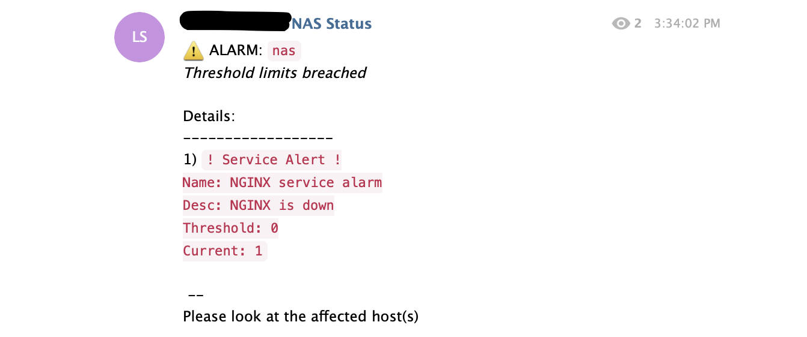

# Raspimon
`Raspimon` is a simple lightweight monitoring tool for your Raspberry Pi. Virtually this can be plugged into any *nix host, but was specifically meant for hosts where a lot of overhead is not really required. It uses Telegram's web API to hook the information directly to your channel but can be extended to work with virtually any other chat/channel service. Think of it like AWS's Cloudwatch alarm configuration but much lighter and you being in total control, always.

This tool can be hooked via a cron and frequency tuned to your choice. If using your Pi with OpenMediaVault as a NAS on your mesh network, you can hook this tool via `Scheduled Jobs` interface.

## Prerequisites
- Python3 on your Raspberry Pi / *nix host
- If using Telegram - BOT ID and Channel ID
- If your host doesn't already have these packages, run `pip3` with the supplied `requirements.txt` to install all dependencies.

## Installation
Download the project and extract at a location of your choice and `cd` inside the project. First, tune your alerts. The alarms config is a `yaml` located at `configs/alarms.yaml`. For config rules see the [Alert Tuning](configs/README.md) section.

> _By default the alarms comes with basic host metric monitoring like cpu and memory, as well as `omv-engined` process monitoring (the process being OpenMediaVault). You can add more `thresholds` to the alarm to configure at different buckets levels (eg. `Warning`, `Critical` etc.)_

### Make
We will use `make` to do the initial setup. Assuming your Bot Token is `MYVERYLONGBOTTOKEN`, your Channel Id is `-100101010101` **and** you have `sudo` privilege hit the following command:

```bash
raspimon $: sudo make BOT_TOKEN=MYVERYLONGBOTTOKEN CHANNEL_ID=-100101010101 install
```

> _We need `sudo` to properly set system wide environment variable. Its written to `/etc/profile.d/raspimon.sh`_

Once done, `raspimon` is ready to be triggered by your best preferred method - `cron`s or UI based jobs.

### Triggers
Raspimon can be manually triggered:
- with Python3 
    ```bash
    $: sudo python3 raspimon.py
    ```
- with Bash
    ```bash
    $: sudo run.sh
    ```

Or the supplied run script `run.sh` can be hooked with `+x` `chmod` permissions to your tool or cron.

<hr/>

## Screenshots
Here is a quick look at how it would look under various situations:

### Configuration Validation error
When a configuration error is encountered - missing `,` or illegal/missing values - a notification is sent to your channel


### Critical Alert
When a host breach happens to one or more of your defined thresholds, an Alarm notification is issued.


When a process breach happens to one or more of your defined thresholds, an Alarm notification is issued.


### Hooking up to OpenMediaVault
If you have setup your Raspberry Pi to act as VPN or as your custom NAS and you are using `OpenMediaVault` you can hook this tool under the `Scheduled Jobs` interface to run every 2 minutes somewhat like this:


## Coming up
- Alert severity
- More metric support, even though this being already highly extensible
- Slack hooks support

:shipit:
<hr>

> (c) _jaiwardhan/raspimon_


