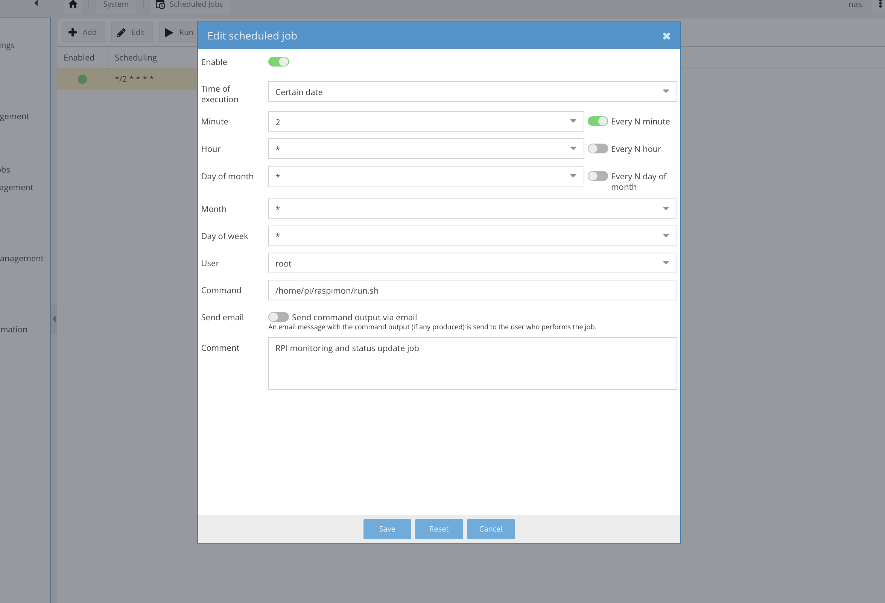

# Raspimon
`Raspimon` is a simple lightweight monitoring tool for your Raspberry Pi. Virtually this can be plugged into any *nix host, but was specifically meant for hosts where a lot of overhead is not really required. It uses Telegram's web API to hook the information directly to your channel but can be extended to work with virtually any other chat/channel service. Think of it like AWS's Cloudwatch alarm configuration but much lighter and you being in total control, always.

This tool can be hooked via a cron and frequency tuned to your choice. If using your Pi with OpenMediaVault as a NAS on your mesh network, you can hook this tool via `Scheduled Jobs` interface.

## Prerequisites
- Python3 on your Raspberry Pi / *nix host
- If using Telegram - BOT ID and Channel ID
- If your host doesn't already have these packages, run `pip3` with the supplied `requirements.txt` to install all dependencies.

## Usage
Expose your BOT ID via `PI_BOT_TOKEN` environment variable. Similarly expose your Channel ID via `PI_CHANNEL_ID` environment variable.

Tune your alerts. The default config comes with `cpu` and `mem` status alarms which looks somewhat like this:
```json
{
	"alarms": {
        "cpu": {
            "name": "CPU Utilization Alarm",
            "thresholds": [{
                "consecutive": 2,
                "description": "CPU Utilization has gone above threshold limit",
                "interval": 300,
                "threshold": 70,
                "trend": "geq"
            }]
        },
        "mem": {
            "name": "Memory Utilization alarm",
            "thresholds": [{
                "consecutive": 2,
                "description": "Memory Utilization has gone above threshold limit",
                "interval": 300,
                "threshold": 70,
                "trend": "geq"
            }]
        }
    }
}
```

You can set multiple thresholds per dimension for a mix-and-match result. As can be seen above, the CPU alarm will go off if the utilization breaches the `70%` mark (greater-than-or-equal-to `geq`) consecutively `2` times within a span of `300` seconds. Same goes for memory. 

Bear in mind that certain fields like `name`, `description`, legal `trend` values and `threshold` need to be stated mandatorily. This is to ensure that the config remains sound enough without having to scan through the code. Missing any of them will result in immediate abort. If adding any custom alarm apart from `"cpu"` and `"mem"`, ensure that the same name is exposed via `PiAlarms.get_stats` method. Else they would be simply ignored. Validation will still continue during initialization phase itself.

### Triggers
Manually trigger the tool by running:
```bash
$: python3 monitor.py
```

Or hook the supplied bash `monitor.sh` with `+x` `chmod` permissions to your tools or cron.

<hr/>

## Screenshots
Here is a quick look at how it would look under various situations:

### Configuration Validation error
When a configuration error is encountered - missing `,` or illegal/missing values - a notification is sent to your channel


### Critical Alert
When a breach happens to one or more of your defined thresholds, an Alarm notification is issued as well


### Hooking up to OpenMediaVault
If you have setup your Raspberry Pi to act as VPN or as your custom NAS and you are using `OpenMediaVault` you can hook this tool under the `Scheduled Jobs` interface to run every 2 minutes somewhat like this:


## Coming up
- Alert severity
- More metric support, even though this being already highly extensible
- Slack hooks support

:shipit:

